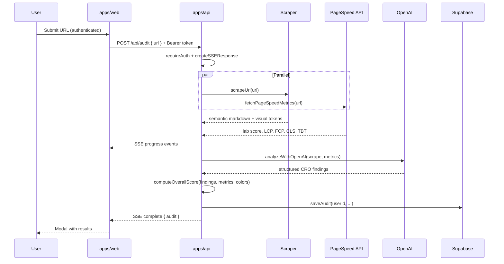

# Architecture — Monolitlabs CRO Auditor

> Technical system design. For development rules and AI agent guidelines, see [AGENT.md](./AGENT.md).

---

## 1. System overview

Monorepo with two deployable apps and one shared package:

```
CRO-Auditor-Test/
├── ARCHITECTURE.md         # System design (this file)
├── AGENT.md                # AI / contributor development guide
├── README.md               # Setup & run instructions
├── docs/
│   └── DESIGN_SYSTEM.md    # UI tokens & components
├── apps/
│   ├── web/                # React + Vite SPA
│   │   └── .env.example    # Frontend env template
│   └── api/                # Cloudflare Worker API
│       └── .dev.vars.example  # Worker secrets template
├── packages/
│   └── shared/             # Shared constants, types & utilities
└── supabase/
    └── migrations/         # Postgres schema (001–004)
```

### Deployment targets

| App | Path | Runtime | Host |
|-----|------|---------|------|
| Web | `apps/web` | Browser SPA | Cloudflare Pages |
| API | `apps/api` | Edge Worker | Cloudflare Workers |

### Tech stack

| Layer | Technology |
|-------|------------|
| Frontend | React 19, Vite, React Router, TypeScript |
| Auth | Supabase Auth (email/password, JWT) |
| Backend | Cloudflare Workers, TypeScript |
| Scraper | `fetch()` + Cheerio (no headless browser) |
| AI | OpenAI API (`gpt-4o-mini`, structured JSON) |
| Performance | Google PageSpeed Insights API (Lighthouse lab) |
| Database | Supabase (Postgres) |

---

## 2. Layered architecture

### API (`apps/api`)

```
HTTP Request
    ↓
index.ts              Entry point, routing, error handling
    ↓
config/index.ts       WorkerEnv → AppConfig
    ↓
context.ts            AppConfig → AppContext (Supabase client)
    ↓
lib/auth.ts           Bearer JWT verification (requireAuth)
    ↓
routes/*.ts           Route handlers (HTTP in/out)
    ↓
services/*.ts         External integrations (OpenAI, PageSpeed, Supabase)
scraper/*.ts          Pure HTML processing (no I/O config)
lib/sse.ts            Server-Sent Events for audit streaming
```

| Layer | Responsibility |
|-------|----------------|
| Entry | Parse request, create config + context, dispatch route |
| Config | Map Cloudflare env bindings → typed config object |
| Context | Instantiate shared Supabase client from config |
| Auth | Verify `Authorization: Bearer <jwt>` via Supabase |
| Routes | HTTP handlers; orchestrate services |
| Services | Business logic & third-party API calls |
| Scraper | Deterministic HTML → markdown + visual tokens |
| SSE | Stream audit progress events to the client |

### Web (`apps/web`)

```
Browser
    ↓
main.tsx              React Router, AuthProvider, protected routes
    ↓
contexts/             AuthContext, AuditsContext
    ↓
pages/                LoginPage, RegisterPage, WorkspacePage
    ↓
components/*.tsx      UI components
    ↓
lib/api.ts            Authenticated HTTP + SSE client
lib/supabase.ts       Supabase client for auth
    ↓
config/index.ts       API base URL + Supabase config
    ↓
apps/api              Worker API
```

---

## 3. Config flow

Environment is loaded once at the boundary layer, then passed as typed objects:

**API**

```
WorkerEnv (Cloudflare binding)
    → createAppConfig()  → AppConfig
    → createAppContext() → AppContext { config, supabase }
    → route handlers     → services receive config/ctx params
```

**Web**

```
import.meta.env (apps/web/.env)
    → apps/web/src/config/index.ts
    → apps/web/src/lib/api.ts, lib/supabase.ts
```

See [AGENT.md](./AGENT.md) for rules on where env may be read.

---

## 4. Authentication

- **Web:** Supabase Auth handles sign-up, sign-in, and session persistence (`AuthContext`).
- **API:** Protected routes require `Authorization: Bearer <access_token>`. `lib/auth.ts` verifies the JWT with Supabase and returns the authenticated user.
- **Database:** `audits.user_id` links each audit to `auth.users`. RLS policies restrict reads/inserts to the owning user (service role bypasses for Worker writes).

Public route: `GET /api/health` only.

---

## 5. Core request flow — POST /api/audit

Returns **Server-Sent Events** (`text/event-stream`), not a single JSON response.



**SSE event types** (see `packages/shared/src/types/audit-stream.ts`):

| Event | Payload | When |
|-------|---------|------|
| `progress` | `{ step, message, status }` | Each pipeline step |
| `complete` | `{ audit }` | Audit saved successfully |
| `error` | `{ message }` | Unrecoverable failure |

Steps: `validating` → `scraping` → `performance` → `analyzing` → `saving`.

---

## 6. Scraper pipeline

Location: `apps/api/src/scraper/`

| Step | Module | Output |
|------|--------|--------|
| Fetch HTML | `index.ts` | Raw HTML via standard `fetch()` |
| Block detection | `blocked-page.ts` | Rejects bot-blocked / empty pages |
| Linked CSS | `stylesheets.ts` | Fetches external stylesheets for color extraction |
| Visual tokens | `colors.ts` | Hex/RGB colors, font families, `color_count_warning` when >3 colors |
| Semantic markdown | `markdown.ts` | Cleansed markdown: `[CTA Button: …]`, `[SECTION: …]`, `#`–`###` headings |

**Runtime constraint:** Edge-compatible only — no Node.js native modules (`fs`, `path`, etc.). `nodejs_compat` flag is enabled in Wrangler for Cheerio.

---

## 7. AI analysis pipeline

Location: `apps/api/src/services/openai.ts`

1. Build prompt from:
   - CRO framework rules (`packages/shared/src/constants/rules.ts`)
   - Scraped semantic markdown
   - PageSpeed lab metrics (score, LCP, FCP, CLS, TBT)
   - Visual tokens (colors, fonts, palette warning)
2. Call OpenAI with structured JSON schema output
3. Compute composite score via `computeOverallScore()` (`packages/shared`)
4. Return `AuditAnalysis`: structured summary, strengths, issues, findings[]

Each finding maps to a framework rule ID (e.g. `KRUG-01`, `CIALDINI-02`).

**Overall score formula** (1–100):

- Performance (PageSpeed): up to 30 pts
- Color palette: up to 20 pts (penalized when >3 distinct colors)
- Framework UX warnings: up to 50 pts (−6 per warning, floor 10)

---

## 8. Shared package

Location: `packages/shared`

```ts
import { CRO_AUDIT_RULES } from "@cro-auditor/shared/constants/rules";
import type { AuditRecord } from "@cro-auditor/shared/types/audit";
import { computeOverallScore } from "@cro-auditor/shared/compute-overall-score";
import { normalizeAuditAnalysis } from "@cro-auditor/shared/normalize-audit-analysis";
import type { AuditStreamEvent } from "@cro-auditor/shared/types/audit-stream";
```

| Export | Content |
|--------|---------|
| `constants/rules` | Krug + Cialdini CRO framework |
| `constants/audit-framework/*` | Individual framework modules |
| `types/audit` | `AuditRecord`, `AuditAnalysis`, `AuditFinding` |
| `types/audit-stream` | SSE event types and step order |
| `compute-overall-score` | Composite CRO score calculation |
| `normalize-audit-analysis` | Backward-compatible analysis normalization |

Used by both `apps/web` and `apps/api`. No runtime dependencies.

---

## 9. API surface

| Method | Path | Auth | Handler | Description |
|--------|------|------|---------|-------------|
| GET | `/api/health` | No | `routes/health.ts` | Health check |
| POST | `/api/audit` | Yes | `routes/audit.ts` | Full CRO audit pipeline (SSE) |
| GET | `/api/audits` | Yes | `routes/audits.ts` | Paginated audit list (`?limit=&offset=`) |
| GET | `/api/audits/:id` | Yes | `routes/audits.ts` | Single audit by UUID |

All JSON responses use `lib/http.ts` for CORS headers. Audit creation streams SSE.

---

## 10. Database

Migrations: `supabase/migrations/001` through `004`

**Schema:** `cro_auditor` (configurable via `SUPABASE_DB_SCHEMA`)

**Table:** `cro_auditor.audits`

| Column | Type | Notes |
|--------|------|-------|
| `id` | UUID | Primary key |
| `user_id` | UUID | FK → `auth.users` (migration 002) |
| `url` | text | Audited URL |
| `title` | text | Page title |
| `performance_score` | integer | Lighthouse score 0–100 |
| `lcp_ms` | integer | Deprecated — mirrors `lab_lcp_ms` |
| `fcp_ms` | integer | Deprecated — mirrors `lab_fcp_ms` |
| `lab_lcp_ms` | integer | Lab Largest Contentful Paint |
| `lab_fcp_ms` | integer | Lab First Contentful Paint |
| `lab_cls_score` | numeric | Lab Cumulative Layout Shift |
| `lab_tbt_ms` | integer | Lab Total Blocking Time |
| `total_colors` | integer | Distinct colors detected |
| `color_count_warning` | boolean | true when >3 colors |
| `colors` | jsonb | Array of hex color strings |
| `font_families` | jsonb | Array of font names |
| `primary_font_family` | text | Primary detected font |
| `semantic_markdown` | text | Cleansed page content |
| `analysis` | jsonb | OpenAI CRO findings |
| `created_at` | timestamptz | Insert timestamp |

**RLS:** Users read/insert own audits; service role has full access (Worker uses service role key for inserts).

---

## 11. Web UI modules

Location: `apps/web/src/`

| Path | Purpose |
|------|---------|
| `main.tsx` | Router, auth provider, route definitions |
| `pages/WorkspacePage.tsx` | Main dashboard: URL form, history, modals |
| `pages/LoginPage.tsx` | Sign-in form |
| `pages/RegisterPage.tsx` | Sign-up form |
| `pages/AppLayout.tsx` | Wraps workspace with `AuditsProvider` |
| `contexts/AuthContext.tsx` | Supabase session state |
| `contexts/AuditsContext.tsx` | Audit list, SSE progress, run audit |
| `config/index.ts` | API base URL + Supabase config |
| `lib/api.ts` | Authenticated fetch + SSE consumer |
| `lib/sse.ts` | Client-side SSE parser |
| `lib/supabase.ts` | Supabase browser client |
| `components/UrlForm.tsx` | URL input & submit |
| `components/AuditResults.tsx` | Full audit report in modal |
| `components/AuditProgress.tsx` | SSE step progress display |
| `components/ColorWarning.tsx` | Palette clutter warning (>3 colors) |
| `components/MetricsPanel.tsx` | Lighthouse lab metrics + font |
| `components/AuditHistory.tsx` | Paginated audit list |
| `components/ProtectedRoute.tsx` | Auth gate for `/` |
| `design-system/` | CSS tokens, base, components, layout |

---

## 12. Environment

Each app manages its own env file — no manual sync step.

| App | Template | Local file | Loaded by |
|-----|----------|------------|-----------|
| Web | `apps/web/.env.example` | `apps/web/.env` | Vite |
| API | `apps/api/.dev.vars.example` | `apps/api/.dev.vars` | Wrangler |

| Variable | App | Purpose |
|----------|-----|---------|
| `VITE_API_URL` | Web | API base URL at build time (empty in dev) |
| `VITE_SUPABASE_URL` | Web | Supabase project URL |
| `VITE_SUPABASE_ANON_KEY` | Web | Client-side Supabase auth |
| `ALLOWED_ORIGIN` | API | CORS allowed origin |
| `OPENAI_API_KEY` | API | OpenAI analysis |
| `PAGESPEED_API_KEY` | API | PageSpeed Insights |
| `SUPABASE_URL` | API | Supabase project URL |
| `SUPABASE_ANON_KEY` | API | JWT verification |
| `SUPABASE_SERVICE_ROLE_KEY` | API | Server-side DB access |
| `SUPABASE_DB_SCHEMA` | API | Postgres schema (default: `cro_auditor`) |

Production API secrets: `wrangler secret put` or `npm run secrets:upload` (see README).
