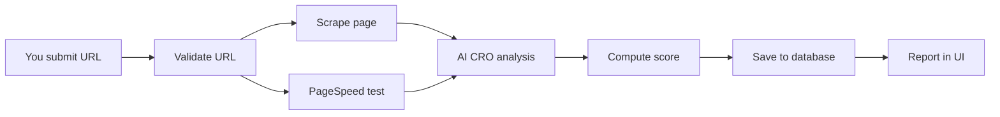

# Monolitlabs CRO Auditor

React (Vite) frontend + Cloudflare Workers API for conversion rate optimization audits. Users sign in with Supabase Auth, submit a URL, and receive a streamed audit with CRO findings, Lighthouse lab metrics, and visual token analysis.

## How it works

### User flow

1. **Sign up / sign in** — Create an account or log in with email and password (Supabase Auth). Sessions persist in the browser.
2. **Open the workspace** — After login you land on the dashboard with a URL input and your audit history.
3. **Submit a URL** — Enter any public `http://` or `https://` page you want to audit (homepage, landing page, product page, etc.).
4. **Watch live progress** — The UI streams real-time steps while the audit runs (scraping, performance test, AI analysis, saving).
5. **Read the report** — When complete, a modal opens with the full CRO report: overall score, findings, metrics, and visual tokens.
6. **Browse history** — Past audits are saved to your account. Open any previous report from the sidebar without re-running the audit.

### What happens when you audit a URL

When you submit a URL, the frontend calls `POST /api/audit` with your JWT. The API returns **Server-Sent Events (SSE)** — a live stream of progress, not a single JSON response.



| Step | What the system does |
|------|----------------------|
| **Validating** | Checks the URL format before starting. |
| **Scraping** | Fetches the page HTML, extracts semantic markdown (headings, CTAs, sections), and detects colors and fonts from the page and its stylesheets. |
| **Performance** | Calls Google PageSpeed Insights (Lighthouse lab) for score, LCP, FCP, CLS, and TBT. Runs in parallel with scraping. |
| **Analyzing** | Sends scraped content + metrics to OpenAI (`gpt-4o-mini`) against CRO frameworks (Steve Krug usability + Robert Cialdini persuasion). Returns structured findings with rule IDs like `KRUG-01`. |
| **Saving** | Computes an overall CRO score (performance + color palette + UX warnings), then stores the full audit in Supabase linked to your user. |

If scraping or performance fails (e.g. bot-blocked page, invalid URL), the stream sends an `error` event and the UI shows the message.

### What you get in each report

| Section | Content |
|---------|---------|
| **Overall score** | Composite 1–100 score from performance, color palette discipline, and framework warnings. |
| **CRO findings** | Actionable issues and strengths mapped to Krug / Cialdini rules, with severity and recommendations. |
| **Lab metrics** | Lighthouse performance score, LCP, FCP, CLS, TBT. |
| **Visual tokens** | Detected colors and fonts; warning when more than 3 distinct colors are used (palette clutter). |

Audits are private per user — you only see reports you created. For the full technical flow (sequence diagram, API schema, DB tables), see [ARCHITECTURE.md](./ARCHITECTURE.md).

## Documentation

| File | Purpose |
|------|---------|
| [ARCHITECTURE.md](./ARCHITECTURE.md) | System design, layers, data flow, API & DB schema |
| [AGENT.md](./AGENT.md) | Rules & conventions for AI agents / contributors |
| [docs/DESIGN_SYSTEM.md](./docs/DESIGN_SYSTEM.md) | UI tokens, components, and UX patterns |

## Quick start

```bash
# 1. Install
npm install

# 2. Environment (each app has its own file)
cp apps/web/.env.example apps/web/.env
cp apps/api/.dev.vars.example apps/api/.dev.vars
# Fill in API keys in both files

# 3. Database — run all migrations in order in Supabase SQL editor
#    supabase/migrations/001_create_audits.sql
#    supabase/migrations/002_add_user_auth.sql
#    supabase/migrations/003_add_enhanced_pagespeed_metrics.sql
#    supabase/migrations/004_drop_field_pagespeed_metrics.sql
# Then add `cro_auditor` to Dashboard → Settings → Data API → Exposed schemas
# Enable Email auth in Dashboard → Authentication → Providers
# Disable "Confirm email" so users can sign in immediately after registration

# 4. Development (two terminals)
npm run dev:api    # API on http://localhost:8787
npm run dev        # Web on http://localhost:5173
```

Or start both from the repo root:

```bash
npm run dev:all
```

## Project layout

```
apps/web/       → React dashboard (Cloudflare Pages)
apps/api/       → Worker API (Cloudflare Workers)
packages/shared → Shared types, CRO rules, score utilities
supabase/       → Database migrations
docs/           → Design system reference
```

## Environment

| App | Template | Local file |
|-----|----------|------------|
| Web | `apps/web/.env.example` | `apps/web/.env` |
| API | `apps/api/.dev.vars.example` | `apps/api/.dev.vars` |

**Web** (`apps/web/.env`):

| Variable | Description |
|----------|-------------|
| `VITE_API_URL` | API URL for production build (leave empty in dev) |
| `VITE_SUPABASE_URL` | Supabase project URL |
| `VITE_SUPABASE_ANON_KEY` | Supabase anon key (client-side auth) |

**API** (`apps/api/.dev.vars`):

| Variable | Description |
|----------|-------------|
| `ALLOWED_ORIGIN` | CORS origin (e.g. `http://localhost:5173`) |
| `OPENAI_API_KEY` | OpenAI API key |
| `PAGESPEED_API_KEY` | Google PageSpeed Insights key |
| `SUPABASE_URL` | Supabase project URL |
| `SUPABASE_ANON_KEY` | Supabase anon key (JWT verification) |
| `SUPABASE_SERVICE_ROLE_KEY` | Supabase service role key |
| `SUPABASE_DB_SCHEMA` | Postgres schema (default: `cro_auditor`) |

Wrangler reads `apps/api/.dev.vars` automatically on `wrangler dev`.

In local dev, Vite proxies `/api` to the Worker (typically `http://localhost:8787`). Leave `VITE_API_URL` empty so the browser uses relative `/api` paths.

## Production deploy

**API (Worker):**

```bash
npm run secrets:upload   # bulk upload from apps/api/.dev.vars
npm run deploy:api
```

Or set secrets individually:

```bash
cd apps/api
npx wrangler secret put OPENAI_API_KEY
npx wrangler secret put PAGESPEED_API_KEY
npx wrangler secret put SUPABASE_URL
npx wrangler secret put SUPABASE_ANON_KEY
npx wrangler secret put SUPABASE_SERVICE_ROLE_KEY
npx wrangler secret put SUPABASE_DB_SCHEMA
npx wrangler secret put ALLOWED_ORIGIN
npm run deploy
```

**Web (Pages):** set `VITE_API_URL`, `VITE_SUPABASE_URL`, and `VITE_SUPABASE_ANON_KEY` in `apps/web/.env`, then:

```bash
npm run deploy:web
```

Preview deploy:

```bash
npm run deploy:web:preview
```

## Tests

```bash
npm test
```

Runs Vitest in `apps/api` (scraper, PageSpeed, HTTP helpers, score utilities).
